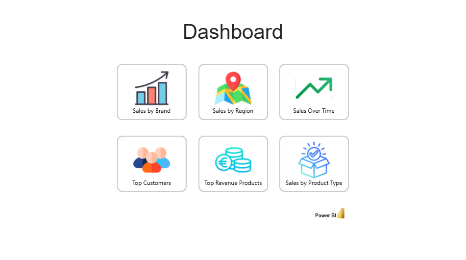
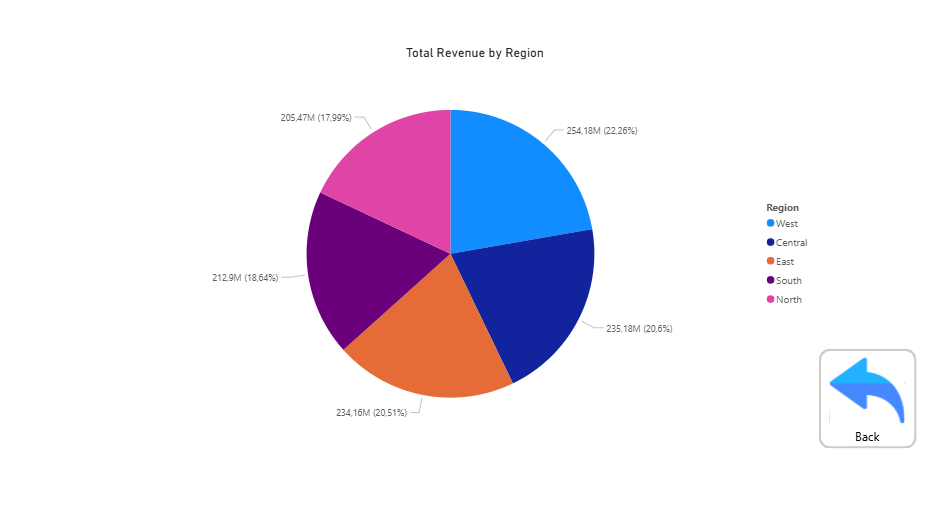

# Power BI SQL Analysis
This project demonstrates the design and implementation of a SQL Server data warehouse using a star schema, followed by sales analysis and visualization in Power BI.

## Project Overview
The project includes:
- Creation of dimension and fact tables
- ETL process for data cleaning and loading
- Sales analysis using a Power BI dashboard

The data warehouse is built on Microsoft SQL Server, while Power BI is used to visualize sales performance across different dimensions.

##Data Model
The data warehouse follows a star schema design, with a central sales fact table connected to multiple dimension tables (Customer, Product, Date, and Location).

## SQL Scripts Execution Order
To correctly build and populate the data warehouse, SQL scripts should be executed in the following order:
1. create_dimension_tables.sql  
2. data_cleaning.sql  
3. load_dimensions.sql  
4. create_fact_table.sql  
5. load_fact.sql  
6. sale_preview.sql (optional)

## Power BI Dashboard
The Power BI report file is available in the `powerbi` folder.
It provides an interactive dashboard for analyzing sales performance across multiple dimensions, including:

- Sales by brand  
- Sales by region  
- Sales trends over time  
- Top customers  
- Top revenue-generating products  
- Sales by product type  

### Dashboard Overview

### Example Analysis

## Note
- The Power BI report requires access to a **local SQL Server instance**
- The database schema and data structure must match the definitions provided in the SQL scripts
- The project is intended for **educational and demonstration purposes**

## Technologies Used
- Microsoft SQL Server (SSMS)
- T-SQL
- Power BI
